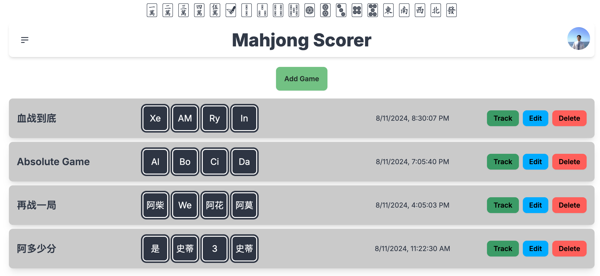
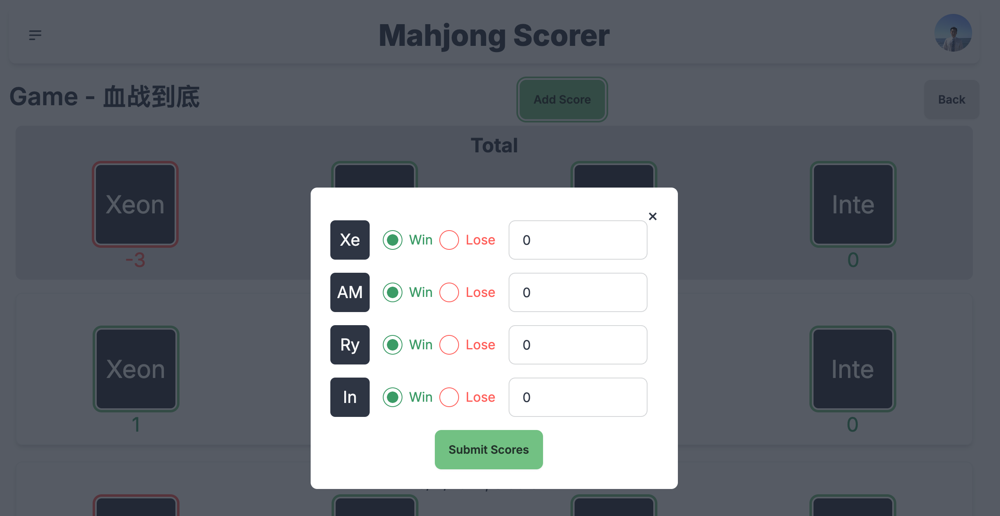
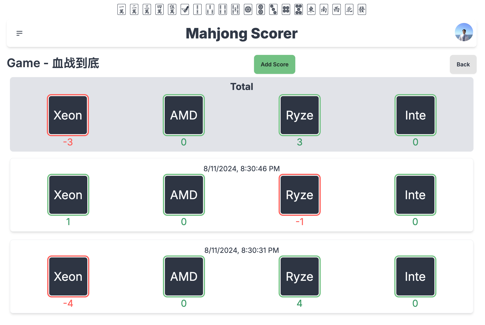

# Mahjong Ledger

Mahjong Ledger is a web application designed to simplify the process of tracking scores during family Mahjong games. Initially developed to avoid the hassle of transferring money via WeChat after each round (and to avoid any potential issues with the authorities), this app provides an easy way for players to keep score and track their game history.

## Link
Deployed on 

## Features

- **User Registration & Login**: Users can create an account and log in to start using the app.
- **Game Creation**: Once logged in, users can create new games and invite other players.
- **Score Tracking**: Easily record the outcome of each round within a game, tracking wins and losses.
- **Score Summary**: A running total of each player's score is displayed at the top of the game, allowing users to see the overall standings at a glance.
- **Game History**: Users can review past games and analyze their performance.

## Screenshots

### Home Screen

### Score Creation

### Score Screen

## Tech Stack

- **Backend**:
  - Supabase: Used for authentication, SQL database management, and bucket storage for user data.
- **Frontend**:
  - React: The core library for building the user interface.
  - Next.js: The framework used for server-side rendering and routing.
  - TypeScript: Ensures type safety and enhances code quality during development.

## How to Use

1. **Register an Account**: Sign up with your email and start creating games.
2. **Create a Game**: Set up a new game, add players, and start tracking scores.
3. **Track Scores**: Enter the results of each round, and the app will automatically update the total scores.
4. **Review Game History**: Look back at past games to see how you and your family performed.

## Motivation

This app was created out of a personal need to simplify scorekeeping during family Mahjong sessions. With Mahjong Ledger, the whole process is now automated, making it easy to keep track of scores without the need for constant WeChat transactions.

Enjoy the game, and may the tiles be ever in your favor!

## Contributing

If you'd like to contribute to the development of Mahjong Ledger, feel free to open a pull request or submit an issue on the GitHub repository.

## License

This project is licensed under the MIT License.

